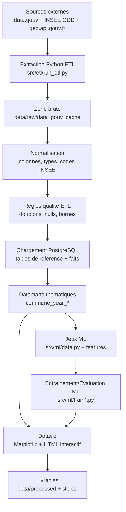

# Flux ETL (BPM/ETL)

Date de reference: 20 avril 2026.

## Objectif
Formaliser le processus de collecte, structuration, controle qualite, chargement et restitution, en lien direct avec la grille MSPR.

## Diagramme de flux

## Orchestration
- Mode manuel: `python -m src.etl.run_etl`
- Mode planifie: DAG Airflow `mspr_idf_presidentielles_etl`

## Timing type (POC)
1. Extraction et cache des sources
2. Nettoyage/normalisation
3. Chargement BDD
4. Construction des features ML
5. Generation dashboards

## Traceabilite
- Sources: [sources.md](/C:/Users/guilhem/Documents/mspr/docs/sources.md)
- Schema BDD: [schema.sql](/C:/Users/guilhem/Documents/mspr/sql/schema.sql)
- MCD: [mcd.md](/C:/Users/guilhem/Documents/mspr/docs/mcd.md)
