# MCD (Modele Conceptuel de Donnees)

Version: 2026-04-02

## Entites
- `geo_department` : departements
  - PK: `dept_code`
  - Attributs: `dept_name`
- `geo_commune` : communes
  - PK: `insee_code`
  - FK: `dept_code -> geo_department.dept_code`
  - Attributs: `commune_name`, `population`, `area_km2`, `latitude`, `longitude`
- `election` : metadata des elections
  - PK: `election_id`
  - Attributs: `election_type`, `election_date`, `round`, `scope`
  - Domaines utilises:
    - `election_type`: `presidentielle`, `municipale`
    - `scope`: `departement`, `commune`
  - Contrainte: `UNIQUE (election_type, election_date, round, scope)`
- `candidate` : candidats
  - PK: `candidate_id`
  - Attributs: `candidate_name`, `party_name`, `party_code`
- `election_result` : resultats par candidat et commune
  - PK composite: (`election_id`, `insee_code`, `candidate_id`)
  - FK: `election_id -> election.election_id`
  - FK: `insee_code -> geo_commune.insee_code`
  - FK: `candidate_id -> candidate.candidate_id`
  - Attributs: `registered`, `votes_cast`, `votes_valid`, `votes`, `vote_share`
- `indicator` : dictionnaire des indicateurs socio-economiques
  - PK: `indicator_id`
  - Attributs: `indicator_code` (unique), `indicator_name`, `unit`, `source`
- `indicator_value` : valeurs annuelles des indicateurs par commune
  - PK composite: (`indicator_id`, `insee_code`, `year`)
  - FK: `indicator_id -> indicator.indicator_id`
  - FK: `insee_code -> geo_commune.insee_code`
  - Attributs: `value`, `source_file`
- `commune_year_economy` : table thematique economie (an, territoire)
  - PK composite: (`insee_code`, `year`)
  - FK: `insee_code -> geo_commune.insee_code`
  - Attributs: `median_standard_of_living`, `declared_income_median`,
    `taxable_households_share`, `social_benefits_income_share`,
    `establishments_count`, `business_creations_count`, `business_creation_rate`,
    `unemployment_rate`, `poverty_rate`
- `commune_year_education` : table thematique education (an, territoire)
  - PK composite: (`insee_code`, `year`)
  - FK: `insee_code -> geo_commune.insee_code`
  - Attributs: `no_diploma_rate_20_24`, `school_leavers_20_24_count`,
    `school_leavers_20_24_no_diploma_count`
- `commune_year_demography` : table thematique demographie (an, territoire)
  - PK composite: (`insee_code`, `year`)
  - FK: `insee_code -> geo_commune.insee_code`
  - Attributs: `population_total`, `population_age_75_plus_count`,
    `population_age_75_plus_share`, `life_expectancy_women`, `life_expectancy_men`
- `commune_year_environment` : table thematique environnement (an, territoire)
  - PK composite: (`insee_code`, `year`)
  - FK: `insee_code -> geo_commune.insee_code`
  - Attributs: `social_housing_share`, `catnat_communes_flood_count`,
    `catnat_communes_storm_count`, `catnat_communes_drought_count`
- `commune_year_election_context` : contexte electoral agrege (an, tour, territoire)
  - PK composite: (`election_type`, `round`, `year`, `insee_code`)
  - FK: `insee_code -> geo_commune.insee_code`
  - Attributs: `registered`, `votes_cast`, `votes_valid`, `turnout_rate`,
    `valid_ballot_rate`, `invalid_ballot_rate`, `winner_share`, `candidate_count`

## Cardinalites
- `geo_department` (1,1) -> (0,N) `geo_commune`
- `geo_commune` (1,1) -> (0,N) `election_result`
- `election` (1,1) -> (0,N) `election_result`
- `candidate` (1,1) -> (0,N) `election_result`
- `indicator` (1,1) -> (0,N) `indicator_value`
- `geo_commune` (1,1) -> (0,N) `indicator_value`
- `geo_commune` (1,1) -> (0,N) `commune_year_economy`
- `geo_commune` (1,1) -> (0,N) `commune_year_education`
- `geo_commune` (1,1) -> (0,N) `commune_year_demography`
- `geo_commune` (1,1) -> (0,N) `commune_year_environment`
- `geo_commune` (1,1) -> (0,N) `commune_year_election_context`

## Regles De Gestion
- Les resultats au niveau departement sont stockes avec un `insee_code` synthetique de type `XX000` dans `geo_commune`.
- Les resultats au niveau commune utilisent le vrai code INSEE a 5 caracteres.
- Le catalogue `indicator` est extensible (nouvelles variables socio, revenus, education, demographie, environnement/CatNat) sans changer le schema relationnel.

## Schema MCD (Mermaid)

```mermaid
erDiagram
    GEO_DEPARTMENT ||--o{ GEO_COMMUNE : contient
    GEO_COMMUNE ||--o{ ELECTION_RESULT : porte
    ELECTION ||--o{ ELECTION_RESULT : genere
    CANDIDATE ||--o{ ELECTION_RESULT : obtient
    INDICATOR ||--o{ INDICATOR_VALUE : definit
    GEO_COMMUNE ||--o{ INDICATOR_VALUE : mesure_sur
    GEO_COMMUNE ||--o{ COMMUNE_YEAR_ECONOMY : decrit_par
    GEO_COMMUNE ||--o{ COMMUNE_YEAR_EDUCATION : decrit_par
    GEO_COMMUNE ||--o{ COMMUNE_YEAR_DEMOGRAPHY : decrit_par
    GEO_COMMUNE ||--o{ COMMUNE_YEAR_ENVIRONMENT : decrit_par
    GEO_COMMUNE ||--o{ COMMUNE_YEAR_ELECTION_CONTEXT : contexte

    %% Domaines metier utilises:
    %% ELECTION.election_type = presidentielle | municipale
    %% ELECTION.scope = departement | commune

    GEO_DEPARTMENT {
        char2 dept_code PK
        text dept_name
    }

    GEO_COMMUNE {
        char5 insee_code PK
        text commune_name
        char2 dept_code FK
        int population
        numeric area_km2
        numeric latitude
        numeric longitude
    }

    ELECTION {
        int election_id PK
        text election_type
        date election_date
        smallint round
        text scope
    }

    CANDIDATE {
        int candidate_id PK
        text candidate_name
        text party_name
        text party_code
    }

    ELECTION_RESULT {
        int election_id PK,FK
        char5 insee_code PK,FK
        int candidate_id PK,FK
        int registered
        int votes_cast
        int votes_valid
        int votes
        numeric vote_share
    }

    INDICATOR {
        int indicator_id PK
        text indicator_code
        text indicator_name
        text unit
        text source
    }

    INDICATOR_VALUE {
        int indicator_id PK,FK
        char5 insee_code PK,FK
        int year PK
        numeric value
        text source_file
    }

    COMMUNE_YEAR_ECONOMY {
        char5 insee_code PK,FK
        int year PK
        numeric median_standard_of_living
        numeric declared_income_median
        numeric taxable_households_share
        numeric social_benefits_income_share
        numeric establishments_count
        numeric business_creations_count
        numeric business_creation_rate
        numeric unemployment_rate
        numeric poverty_rate
    }

    COMMUNE_YEAR_EDUCATION {
        char5 insee_code PK,FK
        int year PK
        numeric no_diploma_rate_20_24
        numeric school_leavers_20_24_count
        numeric school_leavers_20_24_no_diploma_count
    }

    COMMUNE_YEAR_DEMOGRAPHY {
        char5 insee_code PK,FK
        int year PK
        numeric population_total
        numeric population_age_75_plus_count
        numeric population_age_75_plus_share
        numeric life_expectancy_women
        numeric life_expectancy_men
    }

    COMMUNE_YEAR_ENVIRONMENT {
        char5 insee_code PK,FK
        int year PK
        numeric social_housing_share
        numeric catnat_communes_flood_count
        numeric catnat_communes_storm_count
        numeric catnat_communes_drought_count
    }

    COMMUNE_YEAR_ELECTION_CONTEXT {
        text election_type PK
        smallint round PK
        int year PK
        char5 insee_code PK,FK
        int registered
        int votes_cast
        int votes_valid
        numeric turnout_rate
        numeric valid_ballot_rate
        numeric invalid_ballot_rate
        numeric winner_share
        int candidate_count
    }
```

