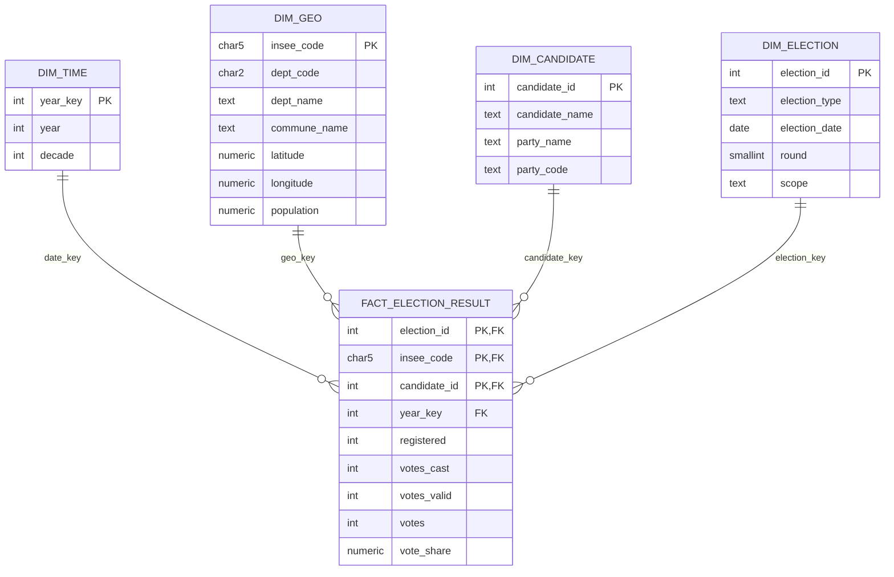

# Modele Multidimensionnel BI (Etoile/Flocon)

Date de reference: 20 avril 2026.

## Objectif
Disposer d'un modele decisionnel explicite pour la restitution BI et l'analyse metier.

## Variante Etoile retenue (principal)


## Variante Flocon (extension)
- `DIM_GEO` peut etre decomposee en:
  - `DIM_DEPARTMENT(dept_code, dept_name)`
  - `DIM_COMMUNE(insee_code, dept_code, commune_name, population, area_km2, latitude, longitude)`
- Cette decomposition est pertinente si les analyses se concentrent sur les hierarchies geographiques.

## Deploiement SQL
Le deploiement du modele decisionnel est fourni dans:
- [bi_datamart.sql](/C:/Users/guilhem/Documents/mspr/sql/bi_datamart.sql)

Le script cree:
1. Schema `bi`
2. Dimensions `bi.dim_time`, `bi.dim_geo`, `bi.dim_candidate`, `bi.dim_election`
3. Table de faits `bi.fact_election_result`
4. Vue de restitution `bi.vw_fact_presidentielle_t1`

## Requete type pour la restitution
```sql
SELECT
  f.year_key AS year,
  g.dept_code,
  g.dept_name,
  c.candidate_name,
  AVG(f.vote_share) AS avg_vote_share
FROM bi.fact_election_result f
JOIN bi.dim_geo g ON g.insee_code = f.insee_code
JOIN bi.dim_candidate c ON c.candidate_id = f.candidate_id
JOIN bi.dim_election e ON e.election_id = f.election_id
WHERE e.election_type = 'presidentielle'
  AND e.round = 1
GROUP BY f.year_key, g.dept_code, g.dept_name, c.candidate_name
ORDER BY year, dept_code, avg_vote_share DESC;
```
