# MCD (Modele Conceptuel de Donnees)

Date de reference: 7 mai 2026.

Source technique de verite: `sql/schema.sql`.

## Perimetre
Le MCD couvre:
1. le referentiel geographique (departement, commune),
2. les elections et resultats de vote,
3. les indicateurs socio-economiques,
4. les tables thematiques annuelles (commune) exploitees en BI/ML.

## Entites et attributs cles
1. `geo_department`
- PK: `dept_code`
- Attributs: `dept_name`

2. `geo_commune`
- PK: `insee_code`
- FK: `dept_code -> geo_department.dept_code`
- Attributs: `commune_name`, `population`, `area_km2`, `latitude`, `longitude`

3. `election`
- PK: `election_id`
- Attributs: `election_type`, `election_date`, `round`, `scope`
- Contrainte: `UNIQUE (election_type, election_date, round, scope)`

4. `candidate`
- PK: `candidate_id`
- Attributs: `candidate_name`, `party_name`, `party_code`

5. `election_result`
- PK composite: (`election_id`, `insee_code`, `candidate_id`)
- FK: `election_id -> election.election_id`
- FK: `insee_code -> geo_commune.insee_code`
- FK: `candidate_id -> candidate.candidate_id`
- Attributs: `registered`, `votes_cast`, `votes_valid`, `votes`, `vote_share`

6. `indicator`
- PK: `indicator_id`
- Attributs: `indicator_code` (unique), `indicator_name`, `unit`, `source`

7. `indicator_value`
- PK composite: (`indicator_id`, `insee_code`, `year`)
- FK: `indicator_id -> indicator.indicator_id`
- FK: `insee_code -> geo_commune.insee_code`
- Attributs: `value`, `source_file`

8. `commune_year_economy`
- PK composite: (`insee_code`, `year`)
- FK: `insee_code -> geo_commune.insee_code`
- Attributs: niveau de vie, revenu, chomage, pauvrete, etablissements, creations

9. `commune_year_education`
- PK composite: (`insee_code`, `year`)
- FK: `insee_code -> geo_commune.insee_code`
- Attributs: diplomes / sorties d'etudes 20-24 ans

10. `commune_year_demography`
- PK composite: (`insee_code`, `year`)
- FK: `insee_code -> geo_commune.insee_code`
- Attributs: population, 75+, esperance de vie

11. `commune_year_environment`
- PK composite: (`insee_code`, `year`)
- FK: `insee_code -> geo_commune.insee_code`
- Attributs: parc social, sinistres catnat

12. `commune_year_election_context`
- PK composite: (`election_type`, `round`, `year`, `insee_code`)
- FK: `insee_code -> geo_commune.insee_code`
- Attributs: `registered`, `votes_cast`, `votes_valid`, `turnout_rate`, `valid_ballot_rate`, `invalid_ballot_rate`, `winner_share`, `candidate_count`

## Cardinalites
1. `geo_department` (1,1) -> (0,N) `geo_commune`
2. `geo_commune` (1,1) -> (0,N) `election_result`
3. `election` (1,1) -> (0,N) `election_result`
4. `candidate` (1,1) -> (0,N) `election_result`
5. `indicator` (1,1) -> (0,N) `indicator_value`
6. `geo_commune` (1,1) -> (0,N) `indicator_value`
7. `geo_commune` (1,1) -> (0,N) `commune_year_economy`
8. `geo_commune` (1,1) -> (0,N) `commune_year_education`
9. `geo_commune` (1,1) -> (0,N) `commune_year_demography`
10. `geo_commune` (1,1) -> (0,N) `commune_year_environment`
11. `geo_commune` (1,1) -> (0,N) `commune_year_election_context`

## Schema (Mermaid)

```mermaid
erDiagram
    geo_department ||--o{ geo_commune : "dept_code"
    geo_commune ||--o{ election_result : "insee_code"
    election ||--o{ election_result : "election_id"
    candidate ||--o{ election_result : "candidate_id"
    indicator ||--o{ indicator_value : "indicator_id"
    geo_commune ||--o{ indicator_value : "insee_code"
    geo_commune ||--o{ commune_year_economy : "insee_code"
    geo_commune ||--o{ commune_year_education : "insee_code"
    geo_commune ||--o{ commune_year_demography : "insee_code"
    geo_commune ||--o{ commune_year_environment : "insee_code"
    geo_commune ||--o{ commune_year_election_context : "insee_code"

    geo_department {
        char_2 dept_code PK
        text dept_name
    }

    geo_commune {
        char_5 insee_code PK
        text commune_name
        char_2 dept_code FK
        int population
        numeric area_km2
        numeric latitude
        numeric longitude
    }

    election {
        int election_id PK
        text election_type
        date election_date
        smallint round
        text scope
    }

    candidate {
        int candidate_id PK
        text candidate_name
        text party_name
        text party_code
    }

    election_result {
        int election_id PK,FK
        char_5 insee_code PK,FK
        int candidate_id PK,FK
        int registered
        int votes_cast
        int votes_valid
        int votes
        numeric_6_5 vote_share
    }

    indicator {
        int indicator_id PK
        text indicator_code
        text indicator_name
        text unit
        text source
    }

    indicator_value {
        int indicator_id PK,FK
        char_5 insee_code PK,FK
        int year PK
        numeric value
        text source_file
    }

    commune_year_economy {
        char_5 insee_code PK,FK
        int year PK
        numeric median_standard_of_living
        numeric declared_income_median
        numeric taxable_households_share
        numeric social_benefits_income_share
        numeric establishments_count
        numeric business_creations_count
        numeric business_creation_rate
        numeric unemployment_rate
        numeric poverty_rate
    }

    commune_year_education {
        char_5 insee_code PK,FK
        int year PK
        numeric no_diploma_rate_20_24
        numeric school_leavers_20_24_count
        numeric school_leavers_20_24_no_diploma_count
    }

    commune_year_demography {
        char_5 insee_code PK,FK
        int year PK
        numeric population_total
        numeric population_age_75_plus_count
        numeric population_age_75_plus_share
        numeric life_expectancy_women
        numeric life_expectancy_men
    }

    commune_year_environment {
        char_5 insee_code PK,FK
        int year PK
        numeric social_housing_share
        numeric catnat_communes_flood_count
        numeric catnat_communes_storm_count
        numeric catnat_communes_drought_count
    }

    commune_year_election_context {
        text election_type PK
        smallint round PK
        int year PK
        char_5 insee_code PK,FK
        int registered
        int votes_cast
        int votes_valid
        numeric turnout_rate
        numeric valid_ballot_rate
        numeric invalid_ballot_rate
        numeric winner_share
        int candidate_count
    }
```

## Tracabilite
- Schema SQL source: [schema.sql](/C:/Users/guilhem/Documents/mspr/sql/schema.sql)
- Modele BI derive: [modelisation_bi.md](/C:/Users/guilhem/Documents/mspr/docs/modelisation_bi.md)
